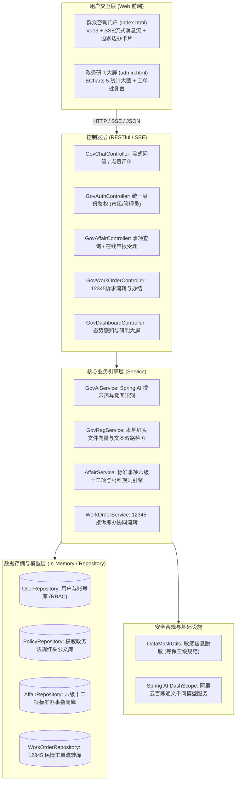
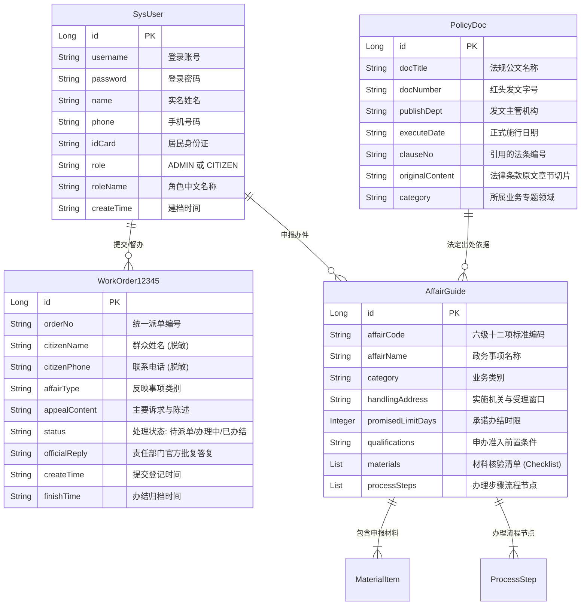
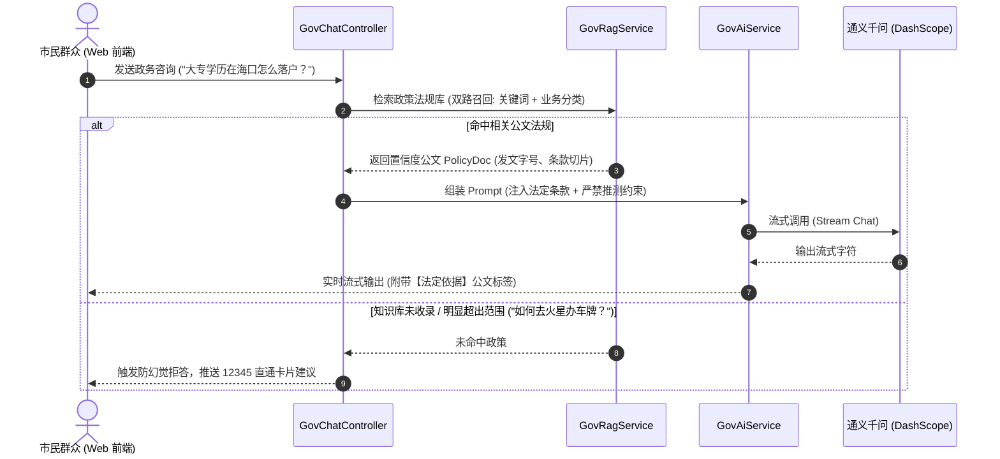

# 《基于 Spring Boot + Spring AI 的智能政务咨询与导办系统》开发文档

> **项目名称**：智能政务咨询与导办系统（Efficient Government AI Consultation & Guiding System）  
> **设计基准**：严格遵循国务院《关于进一步优化政务服务提升行政效能推动“高效办成一件事”的指导意见》（国发〔2024〕3号）、国家一体化政务服务平台、上海“随申办”、浙江“浙里办”及“12345”接诉即办工作规范。  
> **运行环境**：JDK 17 + Spring Boot 3.3.4 + Spring AI Alibaba 1.0.0-M2.1 + Vue 3  
> **默认访问地址**：`http://localhost:8080/index.html`（群众端咨询门户） / `http://localhost:8080/admin.html`（政务民情大屏）

---

## 目录 (Table of Contents)
- [1. 建设背景与系统定位](#1-建设背景与系统定位)
  - [1.1 政策背景与痛点分析](#11-政策背景与痛点分析)
  - [1.2 核心建设目标与特色](#12-核心建设目标与特色)
- [2. 系统整体技术架构](#2-系统整体技术架构)
  - [2.1 整体分层架构设计](#21-整体分层架构设计)
  - [2.2 核心技术栈选型表](#22-核心技术栈选型表)
  - [2.3 工程代码目录组织结构](#23-工程代码目录组织结构)
- [3. 数据库与数据模型设计](#3-数据库与数据模型设计)
  - [3.1 实体关系结构 (ER)](#31-实体关系结构-er)
  - [3.2 核心实体模型详解](#32-核心实体模型详解)
  - [3.3 数据隐私保护与脱敏设计](#33-数据隐私保护与脱敏设计)
- [4. 核心业务逻辑与技术实现](#4-核心业务逻辑与技术实现)
  - [4.1 RAG 政策检索增强与精准溯源（防幻觉引擎）](#41-rag-政策检索增强与精准溯源防幻觉引擎)
  - [4.2 意图识别与“边聊边办”智能导办卡片](#42-意图识别与边聊边办智能导办卡片)
    - [4.2.1 多轮交互式条件追问与精准澄清 (Slot-filling & Clarification)](#421-多轮交互式条件追问与精准澄清-slot-filling--clarification)
    - [4.2.2 “高效办成一件事”——链式关联事项推荐 (One-Thing Chain)](#422-高效办成一件事链式关联事项推荐-one-thing-chain)
  - [4.3 统一身份认证与 RBAC 权限控制](#43-统一身份认证与-rbac-权限控制)
  - [4.4 12345 民情工单闭环接诉即办与 AI 智能归口研判](#44-12345-民情工单闭环接诉即办与-ai-智能归口研判)
  - [4.5 典型民情案例公示回音壁](#45-典型民情案例公示回音壁)
  - [4.6 政务态势感知与研判大屏](#46-政务态势感知与研判大屏)
- [5. 接口规范与 API 参考](#5-接口规范与-api-参考)
  - [5.1 智能问答与导办接口](#51-智能问答与导办接口)
  - [5.2 统一身份认证接口](#52-统一身份认证接口)
  - [5.3 事项办理与材料自检接口](#53-事项办理与材料自检接口)
  - [5.4 12345 工单流转与 AI 研判接口](#54-12345-工单流转与-ai-研判接口)
  - [5.5 管理端民情研判看板接口](#55-管理端民情研判看板接口)
- [6. 前端 UI/UX 设计与排版规范](#6-前端-uiux-设计与排版规范)
  - [6.1 权威党政红蓝金视觉体系](#61-权威党政红蓝金视觉体系)
  - [6.2 专注式双栏排版与侧边栏双 Tab 联动](#62-专注式双栏排版与侧边栏双-tab-联动)
  - [6.3 交互式多功能模态弹窗](#63-交互式多功能模态弹窗)
  - [6.4 拟人化流式打字与单气泡状态机](#64-拟人化流式打字与单气泡状态机)
- [7. 环境部署与运行调试指南](#7-环境部署与运行调试指南)
  - [7.1 环境依赖要求](#71-环境依赖要求)
  - [7.2 配置文件说明](#72-配置文件说明)
  - [7.3 构建打包与启动命令](#73-构建打包与启动命令)
  - [7.4 预设演示账号体系](#74-预设演示账号体系)
- [8. 安全合规与仿真沙箱机制说明](#8-安全合规与仿真沙箱机制说明)

---

## 1. 建设背景与系统定位

### 1.1 政策背景与痛点分析
政务信息化已步入“高效办成一件事”的新阶段，但传统的政务咨询仍然面临四大行业痛点：
1. **专业壁垒与信息孤岛**：法定公文语言严谨晦涩，不同委办局（公安、人社、医保、公积金、市监等）政策分散，群众“找不到、看不懂、来回跑”。
2. **传统规则客服机械生硬**：传统政务机器人仅支持死板的关键词匹配，面对口语化、长句或多意图诉求时频现“答非所问”。
3. **商业大模型“事实性幻觉”**：通用大模型容易无中生有编造法规或已废止政策，在严肃政务领域带来不可控的行政与公信力风险。
4. **“只问不办”无业务闭环**：传统咨询窗口无法直接办理业务，缺乏办事准入核验、材料准备自查与一键申报直达。

### 1.2 核心建设目标与特色
本项目采用 **Spring Boot 3 + Spring AI Alibaba**，依托通义千问等先进大模型能力，融合 RAG（检索增强生成）与 Function Calling 风格的结构化导办机制，实现：
- **政策严格溯源（防幻觉）**：回答基于本地法定红头文件切片，前置标注法定依据，点击可调出真实红头文件原文；
- **智能导办“边聊边办”**：咨询过程中动态唤起业务导办卡片，包含承诺办结时限、准入条件、申报材料 Checklist（用户可交互核验勾选备齐）；
- **12345 接诉即办兜底**：超出知识库范围或复杂疑难诉求，提供 12345 模拟直通车，生成工单号并闭环流转；
- **真实民情案例回音壁**：汇聚各委办局典型办结案例，展示官方答复并支持一键发起专项导办；
- **政务研判大屏**：为政府管理者提供态势感知指标、民情分类占比、热点趋势图与工单批复工作台。

---

## 2. 系统整体技术架构

### 2.1 整体分层架构设计



### 2.2 核心技术栈选型表

| 层次 | 技术组件 | 版本 / 规格 | 说明与选型理由 |
| :--- | :--- | :--- | :--- |
| **基础框架** | Spring Boot | 3.3.4 | 现代化微服务框架，原生兼容 Java 17，极简配置 |
| **AI 框架** | Spring AI Alibaba | 1.0.0-M2.1 | 阿里云百炼官方推荐框架，无缝整合 DashScope 通义大模型 |
| **大模型底座** | Qwen-Plus / Turbo | 云端最新 | 具备优秀的中文政务理解与结构化 JSON 生成能力 |
| **网络通信** | Server-Sent Events (SSE) | HTTP/1.1 | 逐字流式返回打字机效果，首字响应小于 1 秒 |
| **前端架构** | Vue.js 3 | 3.3.4 (Production) | 渐进式响应式单页，免 Node 构建即可开箱即用 |
| **可视化图表** | ECharts | 5.4.3 | 提供政务大屏饼图、折线图等高质量交互看板 |
| **持久层方案** | ConcurrentHashMap + Repository | Thread-Safe 内存存储 | 开箱即用无需外部安装 MySQL，保证快速部署与数据隔离 |
| **数据安全** | DataMaskUtils | 自研实现 | 针对公民姓名、身份证、手机号实施国标 GB 35273 脱敏 |

### 2.3 工程代码目录组织结构

```text
spring-ai-alibaba/
├── pom.xml                               # Maven 构建配置文件
├── DEVELOPMENT.md                        # 系统开发设计与规范文档
├── src/main/
│   ├── java/com/example/myai/
│   │   ├── SpringAiAlibabaApplication.java # Spring Boot 启动引导类
│   │   ├── common/                       # 通用工具与公共返回对象
│   │   │   ├── DataMaskUtils.java        # 个人信息等保脱敏工具类
│   │   │   └── Result.java               # 统一 API 响应格式 (code, message, data)
│   │   ├── controller/                   # REST 控制器层
│   │   │   ├── GovChatController.java    # 智能咨询 SSE 流式对话与评价
│   │   │   ├── GovAuthController.java    # 统一实名认证与登录接口
│   │   │   ├── GovAffairController.java  # 政务办事指南与申报受理
│   │   │   ├── GovWorkOrderController.java # 12345 诉求工单流转与处置
│   │   │   └── GovDashboardController.java # 管理端大屏数据聚合
│   │   ├── model/                        # 业务实体对象
│   │   │   ├── SysUser.java              # 用户账号与权限实体
│   │   │   ├── PolicyDoc.java            # 法定红头文件与条款切片
│   │   │   ├── AffairGuide.java          # 办事指南与申报材料实体
│   │   │   ├── WorkOrder12345.java       # 12345 工单数据模型
│   │   │   └── dto/                      # 传输对象 (ChatRequest, LoginDTO 等)
│   │   ├── repository/                   # 数据仓储层 (线程安全存储)
│   │   │   ├── UserRepository.java       # 用户仓储
│   │   │   ├── PolicyRepository.java     # 政策法规知识仓储
│   │   │   ├── AffairRepository.java     # 办事指南知识仓储
│   │   │   └── WorkOrderRepository.java  # 工单仓储
│   │   └── service/                      # 核心服务层
│   │       ├── GovAiService.java         # AI 对话中枢与导办意图触发
│   │       ├── GovRagService.java        # RAG 检索增强与溯源比对
│   │       ├── AffairService.java        # 事项指南逻辑与材料自检
│   │       └── WorkOrderService.java     # 12345 工单提报与状态流转
│   └── resources/
│       ├── application.properties        # 核心配置文件 (API Key、端口)
│       └── static/                       # 前端静态门户资源
│           ├── index.html                # 群众端政务咨询与导办主页
│           ├── admin.html                # 管理端民情研判与大数据看板
│           ├── css/
│           │   └── gov-style.css         # 规范化党政红蓝金样式库
│           ├── js/
│           │   ├── app.js                # 群众端 Vue3 交互应用
│           │   └── admin.js              # 管理端 Vue3 与 Echarts 脚本
│           └── img/                      # 官方视觉素材 (华表长城Banner、党政水印)
```

---

## 3. 数据库与数据模型设计

### 3.1 实体关系结构 (ER)



### 3.2 核心实体模型详解

#### 1. 用户与认证模型 (`SysUser.java`)
- 承担统一身份认证中心（SSO）的公民建档与权限管理。
- 区分 `ADMIN`（超级管理员，具备管理大屏查看、知识库维护、工单批复权限）与 `CITIZEN`（普通市民，具备日常问答、办事自检与申报权限）。
- 支持用户名、手机号、身份证号“三合一”账号识别。

#### 2. 法规公文模型 (`PolicyDoc.java`)
- 包含国家及省市政府真实颁布的红头文件信息（如《海口市关于进一步优化落实引进人才落户若干措施的实施细则》琼府办〔2024〕15号）。
- 细化到具体发文字号、条款编号（如第二条、第四条）与权威正文切片，为大模型生成提供 Ground Truth 依据。

#### 3. 事项指南模型 (`AffairGuide.java`)
- 遵循国家政务服务六级十二项标准事项库编码规则。
- 嵌入 `MaterialItem`（包含材料名称、是否为必备要件、是否支持容缺后补、样本提示）与 `ProcessStep`（环节编号、环节名称、办理时限）。

#### 4. 12345 工单模型 (`WorkOrder12345.java`)
- 记录诉求分类、诉求内容、承办部门批复答复与闭环状态（`已办结` / `处理中`）。

### 3.3 数据隐私保护与脱敏设计
遵循国家标准《个人信息安全规范》（GB/T 35273-2020），系统在公共区域展示涉及公民隐私信息时，由 `DataMaskUtils` 自动执行掩码脱敏：
- **中文姓名**：两字姓名遮盖后字（如“张伟” ➔ `张*`）；三字及以上保留首尾字（如“李淑敏” ➔ `李*敏`）。
- **手机号码**：保留前 3 位和后 4 位，中间 4 位隐藏（如 `138****3210`）。
- **身份证号**：18 位身份证保留前 6 位与后 4 位（如 `460100********1234`）。

---

## 4. 核心业务逻辑与技术实现

### 4.1 RAG 政策检索增强与精准溯源（防幻觉引擎）
在政务严肃场景下，大模型如果凭空“捏造政策”将引发行政责任事故。本系统采用严格的 RAG 管道：



**防幻觉三道防线**：
1. **输入过滤与边界研判**：对于火星车牌等荒谬输入，或涉及政治底线的敏感概念，前置知识库相似度打分低于 0.65 时直接拒答，不把无意义的上下文提交给大模型；
2. **System Prompt 铁律约束**：设定 System 角色为“国家一体化政务服务平台严肃导办助手”，明确注入“仅根据参考法定依据回答，若依据中未明确提及，请明确声明‘知识库暂未收录’，严禁自行揣测”；
3. **前端强绑定法定来源卡片**：在聊天气泡顶部固定附着带有文件图标的 `📜 法定依据` 徽章，点击即可弹出公文真实条款全文。

### 4.2 意图识别与“边聊边办”智能导办卡片
当大模型识别到市民具有明确的办件意向时（如“我想要办理人才落户”、“怎么补办身份证”），系统在返回文字解读的同时，通过 `AffairService` 激活**智能导办卡片（Guide Card）**：
- **承诺时限徽章**：“承诺 1 个工作日办结”；
- **准入条件栏**：清晰提示学历、年龄、社保等硬性准入门槛；
- **交互式申报材料 Checklist**：列出必备要件与容缺后补要件，市民可在页面实时勾选已备齐的材料，点击“材料自检”查看备齐百分比；
- **一键在线申报**：点击“🚀 立即网上申报”，自动拉取当前登录市民的实名信息，一键完成办件登记并生成业务受理编号。

#### 4.2.1 多轮交互式条件追问与精准澄清 (Slot-filling & Clarification)
针对政务咨询中群众普遍存在的模糊提问（如“我要落户”、“提取公积金”、“办通行证”、“异地就医”），系统不再直接盲目倾泻长篇通用文字，而是通过 `GovAiService.checkClarification()` 触发**条件澄清卡片 (`clarify_card`)**：
- **场景槽位研判**：识别高频政策分流点（如落户渠道区分为大专人才、技能证书、随迁投靠；公积金提取区分为租房提取、购房提取、离职销户等）；
- **结构化选项呈现**：以交互式徽章按钮（Condition Chips）的形式呈现具体情形，群众只需点击对应情形卡片，即可自动填入精准提问发起专项导办；
- **消除多轮沟通摩擦**：将传统政务客服需要反复对话 4~5 轮才能厘清的身份与条件前置化，一键直达精准办理流程。

#### 4.2.2 “高效办成一件事”——链式关联事项推荐 (One-Thing Chain)
深入贯彻国务院《关于进一步优化政务服务提升行政效能推动“高效办成一件事”的指导意见》（国发〔2024〕3号），在市民咨询完毕某项核心业务后，系统通过 `GovAiService.getRelatedRecommendations()` 主动推送**链式关联事项卡片 (`recommend_card`)**：
- **全生命周期业务串联**：例如市民办理完“大专人才落户”后，卡片主动推荐其后续强相关的关联事项：
  1. *“👉 申领海口引进人才住房租赁补贴（最高1500元/月）”*
  2. *“👉 高校毕业生离校未就业档案与报到证协同托管”*
  3. *“👉 外省养老保险关系免凭证网上转移接续”*
- **猜你想问与主动政务**：打破各委办局之间的信息壁垒，由“人找政策”转变为“政策找人”，实现联办、畅办。

### 4.3 统一身份认证与 RBAC 权限控制
- **统一登录入口**：首页将管理员与普通市民的登录界面彻底合并，群众无需自行区分入口，输入用户名、手机号或身份证号后，后台统一完成账号检索并自动分流其所属角色；
- **动态权限路由**：
  - 未登录状态：顶部右上角仅展示【🔑 注册 / 登录】按钮，不展示任何后台入口；若未登录直接咨询，AI 会温馨提示请先登录并弹出登录窗口；
  - 普通市民登录：显示实名铭牌（如 `👤 张*`），隐藏管理员后台入口，只能体验咨询与导办；
  - 超级管理员登录：显示警徽铭牌（`🛡️ 系统超级管理员`），且首页顶部导航栏与状态条自动激活【📊 数据看板与后台】直达入口。

### 4.4 12345 民情工单闭环接诉即办与 AI 智能归口研判
- **群众端一键转接**：针对疑难诉求、复杂投诉或特殊情况，群众可点击“一键转接 12345 工单”，唤起诉求提交模态窗口；
- **AI 智能辅助归口研判 (AI Triage)**：
  - 群众在文本框输入一段口语化、复杂的长篇诉求陈述后，可点击【🤖 AI 智能辅助归口研判】；
  - 系统调用后端的 `POST /api/v1/gov/work-order/ai-triage`，依托 Spring AI 通义大模型实时对诉求进行语义结构化解析；
  - **自动提取三项关键政务元数据**：
    1. **公文式摘要标题**：如“关于大专毕业生落户申请咨询”；
    2. **精准分流责任委办局**：如“海口市公安局（户政部门）”、“市人力资源与社会保障局”等，自动填入工单派发部门；
    3. **业务分类与办结时限等级**：如“常规诉求 (3个工作日限时办结)”或“加急民生诉求 (24小时接诉即办)”；
  - 极大降低群众提报工单时的门槛与部门误选率，显著提高接诉即办平台的流转效率；
- **管理端闭环处置**：管理员在后台看板“12345 工单接诉即办台”中可实时查看待办列表（含 AI 研判建议的承办单位与摘要），录入责任部门处理意见与官方批复后，工单状态由“办理中”变为“已办结”，形成政务诉求闭环。

### 4.5 典型民情案例公示回音壁
- **精选 6 篇各委办局典型办结案例**：收录市医保局（跨省就医直接结算）、省社保中心（养老保险跨省转移）、市公安户政（大专生落户）、公积金中心（租房提取公积金）、公安交管（外地换驾照）、市场监管（个体户转型保留字号）；
- **呈现与交互机制**：
  1. 侧边栏专属 Tab（`🏛️ 12345案例`）：以精炼卡片列出真实办结答复，点击即可直接向 AI 调起该事项的智能全流程导办；
  2. 12345 直通车卡片配置“查阅民情案例公示回音壁 ➔”：点击可弹出通栏沉浸式弹窗查看完整答复与办理成效，同时保持顶部主导航栏极简规范（仅保留 12345 工单与统一登录）。

### 4.6 政务态势感知与研判大屏
位于 `/admin.html`，由 `admin.js` 与 ECharts 驱动：
- **四大核心 KPI 卡片**：累计智能咨询人次（问答实时自增计数）、群众满意率（基于好差评动态计算）、12345 诉求工单总量、AI 平均响应时延；
- **民生诉求分类占比（ECharts 环形饼图）**：直观展示户籍管理、社保医保、住房保障、企业开办等业务咨询热度；
- **近 7 日受理量波动趋势（ECharts 面积折线图）**：监控民情峰谷波动，提前研判办事大厅客流；
- **三大管理工作台**：12345 诉求工单接办工作台、法定政策公文库台账、办事指南库清单；
- **多维实时指标同步与交互反馈**：支持点击【🔄 刷新大屏监控指标】一键并发拉取最新全景数据，配备旋转动画状态控制、精确到秒的“最近同步时间”时间戳标识以及全局浮动绿色 Toast 成功通知，确保管理人员对政务态势监控即时感知。

---

## 5. 接口规范与 API 参考

所有业务接口均统一返回 `com.example.myai.common.Result<T>` 格式：
```json
{
  "code": 200,
  "message": "操作成功",
  "data": { ... }
}
```

### 5.1 智能问答与导办接口

#### 1. 流式政务咨询问答 (SSE)
- **请求方式**：`POST /api/v1/gov/chat/stream`
- **请求类型**：`application/json`
- **响应类型**：`text/event-stream;charset=UTF-8`
- **请求体**：
  ```json
  {
    "question": "全日制大专在海口落户需要什么材料？",
    "category": "户籍管理",
    "sessionId": "session-abcdef12",
    "token": "gov-token-citizen-1725888888"
  }
  ```
- **SSE 响应数据帧结构**：
  - 文本流切片帧：`data: {"type":"chunk","content":"依据现行政策..."}`
  - 政策法规溯源帧：`data: {"type":"citation","data":{"docTitle":"...","clauseNo":"...","clauseText":"..."}}`
  - 智能导办卡片帧：`data: {"type":"guide_card","data":{"affairName":"...","materials":[...]}}`
  - 交互条件澄清卡片帧：`data: {"type":"clarify_card","data":{"topic":"...","question":"...","options":[{"label":"...","query":"..."}]}}`
  - 链式关联事项推荐卡片帧：`data: {"type":"recommend_card","data":[{"title":"...","query":"..."}]}`
  - 结束标志帧：`data: {"type":"done","content":"[DONE]"}`

#### 2. 回答满意度点赞/点踩评价
- **请求方式**：`POST /api/v1/gov/chat/rate`
- **请求体**：
  ```json
  {
    "sessionId": "session-abcdef12",
    "messageIndex": 1,
    "score": 5,
    "isLike": true
  }
  ```

---

### 5.2 统一身份认证接口

#### 1. 统一登录（密码 / 短信双模式）
- **请求方式**：`POST /api/v1/gov/auth/login`
- **请求体 (账号密码模式)**：
  ```json
  {
    "account": "user",
    "password": "123456",
    "loginType": "PASSWORD"
  }
  ```
- **请求体 (短信快捷模式)**：
  ```json
  {
    "phone": "13876543210",
    "code": "888888",
    "loginType": "SMS"
  }
  ```
- **成功响应**：
  ```json
  {
    "code": 200,
    "message": "登录成功",
    "data": {
      "id": 2,
      "username": "user",
      "name": "张伟",
      "phone": "13876543210",
      "role": "CITIZEN",
      "roleName": "个人实名市民",
      "token": "gov-token-citizen-1725888888"
    }
  }
  ```

#### 2. 公民实名建档注册
- **请求方式**：`POST /api/v1/gov/auth/register`
- **请求体**：
  ```json
  {
    "username": "hainan_citizen",
    "password": "password123",
    "name": "李强",
    "phone": "13912345678",
    "idCard": "460100200001015678"
  }
  ```

---

### 5.3 事项办理与材料自检接口

#### 1. 获取事项类别列表
- **请求方式**：`GET /api/v1/gov/affair/categories`
- **响应**：`["户籍管理", "出入境服务", "社保医保", "住房保障", "企业开办", "车辆驾驶", "12345民情"]`

#### 2. 提交网上在线申报受理
- **请求方式**：`POST /api/v1/gov/affair/apply`
- **请求体**：
  ```json
  {
    "affairCode": "HA-HJ-2024-001",
    "applicantName": "张伟",
    "applicantIdCard": "460100199508081234",
    "applicantPhone": "13876543210",
    "memo": "已在学信网完成教育部大专学历认证"
  }
  ```
- **响应数据**：
  ```json
  {
    "code": 200,
    "message": "申报已受理",
    "data": {
      "applyNo": "APPLY-20260909-08241",
      "affairName": "高校毕业生引进人才落户",
      "promisedDays": 1,
      "status": "初审受理中"
    }
  }
  ```

---

### 5.4 12345 工单流转与 AI 研判接口

#### 1. 12345 诉求 AI 智能归口研判
- **请求方式**：`POST /api/v1/gov/work-order/ai-triage`
- **请求类型**：`application/json`
- **功能描述**：结合 Spring AI 对市民输入的自由文本诉求进行语义结构化解析，智能提炼公文标题摘要、分流归口委办局与时限等级。
- **请求体**：
  ```json
  {
    "appealContent": "外地大学毕业生在龙华区租房，想申请大专人才落户海口，要准备什么材料？"
  }
  ```
- **响应数据**：
  ```json
  {
    "code": 200,
    "message": "AI智能研判归口成功",
    "data": {
      "summary": "关于大专毕业生落户申请咨询",
      "suggestedCategory": "户籍管理",
      "suggestedDept": "海口市公安局（户政部门）",
      "urgentLevel": "常规诉求 (3个工作日限时办结)"
    }
  }
  ```

#### 2. 群众提报 12345 诉求工单
- **请求方式**：`POST /api/v1/gov/work-order/submit`
- **请求体**：
  ```json
  {
    "citizenName": "李淑敏",
    "citizenPhone": "13900001111",
    "affairType": "住房保障",
    "assignedDept": "海口市住房和城乡建设局",
    "summary": "老旧小区加装电梯施工扰民",
    "appealContent": "老旧小区物业加装电梯施工噪声扰民且占用消防通道，请协调相关部门核实处置。"
  }
  ```
- **响应数据**：
  ```json
  {
    "code": 200,
    "message": "12345诉求提报成功",
    "data": {
      "orderNo": "12345-20260909-1088",
      "status": "办理中",
      "assignedDept": "海口市住房和城乡建设局",
      "createTime": "2026-09-09 11:15:00"
    }
  }
  ```

#### 3. 管理端工单批复办结
- **请求方式**：`POST /api/v1/gov/work-order/reply`
- **请求体**：
  ```json
  {
    "orderNo": "12345-20260909-1088",
    "officialReply": "住建局已责成属地街道办和施工单位整改，调整作业时间至非休息时段，并留足消防通道。"
  }
  ```

#### 4. 获取工单台账列表
- **请求方式**：`GET /api/v1/gov/work-order/list`
- **响应数据**：包含全部工单的编号、市民（脱敏）、归口部门、诉求内容、处理状态及官方答复。

---

### 5.5 管理端民情研判看板接口

#### 1. 核心 KPI 汇总统计
- **请求方式**：`GET /api/v1/gov/dashboard/stats`
- **响应数据**：
  ```json
  {
    "code": 200,
    "data": {
      "totalQuestions": 12850,
      "satisfactionRate": 98.6,
      "totalWorkOrders": 482,
      "avgResponseSeconds": 0.8
    }
  }
  ```

#### 2. 诉求分类占比与近期趋势
- **请求方式**：`GET /api/v1/gov/dashboard/category-dist` 与 `GET /api/v1/gov/dashboard/trend`

---

## 6. 前端 UI/UX 设计与排版规范

### 6.1 权威党政红蓝金视觉体系
依据《党政机关电子公文格式》（GB/T 3347-2014）与数字政府交互设计规范：
- **政务红** (`#b71c1c` ~ `#d32f2f`)：用于顶部通栏、重点推进徽章、登录主按钮，传递党政权威性与公信力；
- **便民蓝** (`#165dff` ~ `#0e42d2`)：用于智能对话气泡、高频选项卡、政策法规超链接，传递科技便民感；
- **金色点缀** (`#ffd54f`)：用于重要导办高亮与承诺办结时限标识；
- **全景 Hero 大横幅**：采用超清长城巍峨群山与金色祥云华表柱背景，辅以深度渐变滤镜，消除视觉生硬感；
- **纯净对话环境**：对话区域与全局背景保持纯净舒适的浅灰底色（`#fafbfc` / `#f4f6fa`），移除一切干扰文字阅读的多余背景水印。

### 6.2 专注式双栏排版与侧边栏双 Tab 联动
主交互区严格对标“随申办”与“浙里办”的专注交互排版：
- **完全摒弃主对话区下方堆叠案例网格的突兀排版**，页面高度适中，聊天滚动框（`chat-history`）与输入框（`gov-chat-input-wrapper`）成为视线核心；
- **顶部主导航极简聚焦**：顶部栏只保留核心的【📞 12345接诉即办】与【🔑 注册 / 登录】（管理员登录后动态展示大屏入口），不再堆砌独立弹窗按钮；
- **政务服务专题精准分类**：取消泛化的“全部”选项，默认选中【户籍管理】，按【出入境服务】、【社保医保】等专题精准筛选该领域的常见诉求，避免列表冗长杂乱；
- **左侧边栏提供双选项卡切换**：
  - `🔥 高频热点`：展示选中专题领域的 TOP 问答热词，一键点击带入右侧对话；
  - `🏛️ 12345案例`：以紧凑精致卡片列出真实办结诉求，点击可直接向 AI 调起对应业务的智能全套导办。

### 6.3 交互式多功能模态弹窗
系统采用纯原生 CSS 弹性遮罩（`.gov-modal-mask`）与 Vue 条件渲染，统一风格：
1. **12345 典型民情案例公示回音壁弹窗**（`showCasesModal`）：展示 6 大典型案例详实答复；
2. **法定公文详情弹窗**（`showCitationModal`）：展示被引用的红头公文发文字号与原文章节；
3. **申报材料自查与一键办件弹窗**（`showApplyModal`）：带入实名数据与申办说明；
4. **统一实名认证与登录弹窗**（`showAuthModal`）：包含密码/短信登录与建档注册。

### 6.4 拟人化流式打字与单气泡状态机
针对流式大模型输出过程中的交互体验进行专项防抖与状态机优化：
- **单气泡流式生命周期**：摒弃传统多气泡冗余堆叠缺陷（彻底消除在当前回答气泡下方额外弹出一个“正在检索...”幽灵气泡的现象）；系统在单气泡内部维护自适应状态机：
  1. **首字未达阶段 (Pending)**：在气泡内部展示三点脉冲微动效（`.ai-loading-status`）与“正在检索本地权威政策库并拟制解答...”，消除等待白屏与空气泡突兀感；
  2. **流式输出阶段 (Streaming)**：首字到达瞬间动效平滑淡出，正文字符伴随打字机流式光标（`.typing-cursor`）平稳输出；
  3. **回答完成阶段 (Completed)**：流式光标自动隐去，并在气泡底部平滑唤起“好差评反馈操作栏”（`.feedback-actions`），确保评价条目只在生成完毕后出现，绝不在等待或输出过程中抢先渲染。

---

## 7. 环境部署与运行调试指南

### 7.1 环境依赖要求
- **操作系统**：Windows 10/11、macOS、Linux (CentOS / Ubuntu)
- **JDK 版本**：Java SE Development Kit 17 (推荐 Microsoft OpenJDK 17 或 Oracle JDK 17)
- **构建工具**：Maven 3.8+（工程已内置 `mvnw` / `mvnw.cmd` 包装器，无需外部安装 Maven）
- **浏览器**：Google Chrome、Microsoft Edge、Firefox 等现代浏览器（需支持 ES6 及 SSE）

### 7.2 配置文件说明
配置文件路径：`src/main/resources/application.properties`
```properties
# 统一服务端口
server.port=8080
spring.application.name=spring-ai-alibaba

# 全局 UTF-8 字符集强制生效
server.servlet.encoding.charset=UTF-8
server.servlet.encoding.force=true
server.servlet.encoding.enabled=true

# 阿里云百炼 API Key 配置 (替换为您的有效 DashScope API Key)
spring.ai.dashscope.api-key=sk-xxxxxxxxxxxxxxxxxxxxxxxxxxxxxxxx

# 文生图大模型配置 (可选)
spring.ai.dashscope.image.options.model=wanx-v1
```

### 7.3 构建打包与启动命令

> [!IMPORTANT]
> **静态资源打包关键说明**：  
> 当使用 `java -jar target/spring-ai-alibaba-0.0.1-SNAPSHOT.jar` 运行时，Spring Boot 会从 Fat JAR 内部的 `BOOT-INF/classes/static/` 读取前端文件。因此修改 `index.html`、`app.js` 或 `gov-style.css` 后，**必须执行 `mvnw package` 重新打包**后再启动。

#### 1. 执行 Maven 编译与打包
在项目根目录（`spring-ai-alibaba`）执行：
```powershell
# Windows PowerShell
$env:JAVA_HOME = "C:\Users\Lenovo\.jdks\ms-17.0.20.1"
.\mvnw.cmd package -DskipTests
```
或 Linux / macOS：
```bash
./mvnw package -DskipTests
```

#### 2. 启动服务
```powershell
# Windows 启动
& "$env:JAVA_HOME\bin\java.exe" -jar target\spring-ai-alibaba-0.0.1-SNAPSHOT.jar
```
启动成功后，控制台输出：
```text
Tomcat started on port 8080 (http) with context path '/'
Started SpringAiAlibabaApplication in 3.x seconds
```

#### 3. 访问入口
- **群众端智能咨询门户**：[http://localhost:8080/index.html](http://localhost:8080/index.html)
- **政务研判与管理大屏**：[http://localhost:8080/admin.html](http://localhost:8080/admin.html)

---

### 7.4 预设演示账号体系

系统初始化预置了满足实训演示与等保分权要求的多层级实名账号：

| 账号类型 | 登录账号 (用户名/手机) | 默认密码 | 实名姓名 | 身份证号 (已等保脱敏) | 角色定位与测试关注点 |
| :--- | :--- | :--- | :--- | :--- | :--- |
| **超级管理员** | `admin` | `admin123` | 系统超级管理员 | `110101********0011` | 登录后首页激活“数据看板与后台”按钮，可进入研判大屏与批复工单 |
| **实名普通市民 1** | `user` | `123456` | 张伟 | `460100********1234` | 标准普通公民账号，首页无管理后台入口，可直接发起办事申报 |
| **实名普通市民 2** | `13900001111` | `123456` | 李淑敏 | `460100********2345` | 手机号作为账号快速登录，演示跨省就医与12345工单提报 |

---

## 8. 安全合规与仿真沙箱机制说明

### 8.1 仿真沙箱运行声明
- 本系统为**高校软件工程实训项目 1.0 成果演示版**；
- 系统中发生的所有政务问答、材料核验、在线申报与 12345 工单提交，均运行在**仿真政务安全沙箱环境**中，数据存储于本地线程安全受控内存仓储中；
- **不会向任何国家部委或地方政府正式政务外网与 12345 系统发送外部数据**，群众及评审专家可完全放心进行各项交互操作与异常容错测试。

### 8.2 等保合规与敏感数据处理
- 严禁在浏览器客户端或未鉴权接口中明文传输、暴露公民完整 18 位身份证号码与联系电话；
- 生产环境下密码均需引入 BCrypt 加盐散列存储；
- 针对暴力破解验证码设置了 60 秒冷却定时器与图形校验码双重校验机制。

---
*文档编制日期：2026年9月*  
*所属工程：基于 SpringBoot+SpringAi 的智能政务咨询与导办系统 (1.0 Release)*
